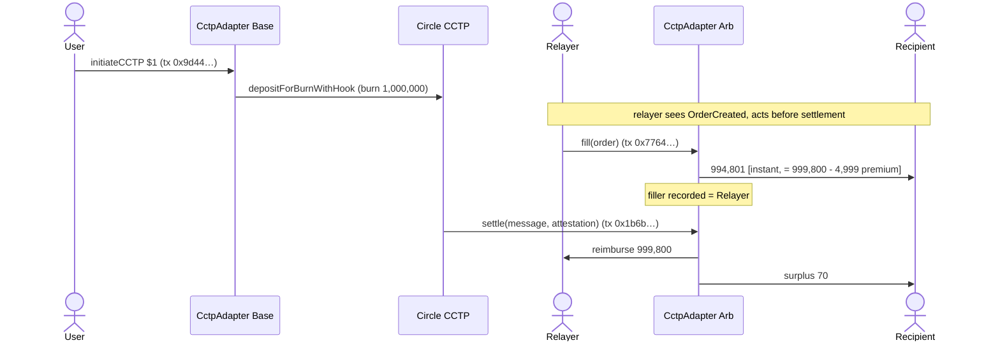

# fast-fill — Live Mainnet Demo (CCTP, Base ⇄ Arbitrum)

This is a record of fast-fill running **on Ethereum mainnet L2s with real USDC**: the `CctpAdapter`
deployed on Base and Arbitrum, three real $1 transfers, settled through Circle's real attestation
service and `MessageTransmitterV2`. All amounts are in USDC base units (6 decimals; `1,000,000` = $1).

> Prototype, unaudited. Run with ~$5 of USDC for demonstration only.

## Deployments

| What | Address |
|---|---|
| `CctpAdapter` (Base) | [`0xC4a956Ec34BF7C0B07e4c84B72232E83879Ce1c0`](https://basescan.org/address/0xC4a956Ec34BF7C0B07e4c84B72232E83879Ce1c0) |
| `CctpAdapter` (Arbitrum) | [`0xA4a9CaC201a6A625C04552624d8D1b172B08fad9`](https://arbiscan.io/address/0xA4a9CaC201a6A625C04552624d8D1b172B08fad9) |
| User / relayer (EOA) | `0xA06Bf163BC51A457D99C6283e78897727c4fDdF2` |

Owner = the EOA. Wired bidirectionally: domains (Base 6, Arbitrum 3), remote adapters, and per-chain
USDC (`remoteUsdc`).

## Runs 1 & 2 — baseline path (no relayer)

A $1 transfer Base→Arbitrum with **no optimistic fill**: the recipient simply receives the funds when
the CCTP message settles. Each delivered **999,870** (the 130-unit haircut is Circle's 1.3 bps
fast-transfer fee). These also seeded USDC onto Arbitrum to use as relayer liquidity for Run 3.

| Step | Chain | Tx |
|---|---|---|
| Run 1 — burn (`initiateCCTP`) | Base | [`0x1ac1f0d3…dde2d2`](https://basescan.org/tx/0x1ac1f0d3d32206a553d9e924ec2c6809f7351765f22725577dd4db0ed4dde2d2) |
| Run 1 — settle | Arbitrum | [`0x4920e31c…dc405d`](https://arbiscan.io/tx/0x4920e31c4fba9ca7603b1858bc8a7a71409f001183e4e2cd45a0758fe0dc405d) |
| Run 2 — burn | Base | [`0x9119fa4b…43afe2`](https://basescan.org/tx/0x9119fa4ba68d80a59e440f1c8ca54671602456a92b64be11cf06eaec9543afe2) |
| Run 2 — settle | Arbitrum | [`0x71361a96…90c2c8`](https://arbiscan.io/tx/0x71361a96414e2eaf08ea82a797e1ed6dfe531922c52bdae536392d168e90c2c8) |

## Run 3 — optimistic fill (the headline)

A $1 transfer Base→Arbitrum to a **fresh recipient** `0xb959…bE53`, with a user-chosen premium that
caps at the adapter's 0.5%. The relayer fronts the funds on Arbitrum **before** the bridge settles,
then is reimbursed when it does.

| Step | Chain | Tx | Effect |
|---|---|---|---|
| initiate ($1, premium order) | Base | [`0x9d449485…573d09`](https://basescan.org/tx/0x9d44948558ebf817507ccb24459c0ac9b3b1769d71dd72280ea5ea9501573d09) | burns 1,000,000; `outputAmount` = 999,800 |
| **fill** (relayer) | Arbitrum | [`0x7764c033…1625fde`](https://arbiscan.io/tx/0x7764c0335030f2b9bf704e9662cfedfdc6c0d10830eceb6a58a4a7cf51625fde) | recipient **+994,801 instantly** |
| settle | Arbitrum | [`0x1b6bc543…4614e3`](https://arbiscan.io/tx/0x1b6bc543094da169213737f095796415a850f50fb0995f789e912bc4574614e3) | relayer **+999,800**; recipient **+70** surplus |

orderId `0x5711e377…8286af`; final record `filler = EOA, status = Settled`.

### Outcome

| Party | Result |
|---|---|
| Recipient `0xb959…bE53` | **994,871** total — of which **994,801 arrived at fill time**, before the bridge settled |
| Relayer (EOA) | net **+4,999** (~$0.005) — the 0.5% premium earned for fronting capital over the bridge-latency window |
| Premium | 4,999 / 999,800 ≈ **0.5%** (the adapter `maxFeeRate` cap) |

The recipient got their money in seconds instead of waiting for CCTP, for a sub-cent premium; the
relayer earned that premium. And Runs 1–2 show the fallback: if nobody fills, the recipient just
gets the funds when CCTP settles, at no premium.

## How it was reproduced

> Note: this run predates the config-registry refactor, so the deploy/wire steps below reflect the
> original per-instance setters. The current flow deploys one immutable `FastFillConfig` (CREATE2)
> and adapters that need no wiring — see [README → Deploy](README.md#deploy). The fill/attest/settle
> mechanics are unchanged.

1. **Deploy** `CctpAdapter` on each chain (`forge create`, constructor: owner, maxFeeRate,
   `TokenMessengerV2`, `MessageTransmitterV2`, USDC).
2. **Wire** each: `setDomain`, `setRemoteAdapter`, `setRemoteUsdc` (addresses in
   [`script/config/Addresses.sol`](script/config/Addresses.sol)).
3. **Initiate** on the source: approve the adapter, then `initiateCCTP(dstChainId, recipient,
   amount, maxFee, minFinalityThreshold, deliveryWindow, discountRate, baseFee)` — `minFinalityThreshold`
   is 1000 (fast) or 2000 (finalized); `deliveryWindow` is relative seconds; `baseFee` is the flat fee
   (0 for none). (This historical run predated the relative-window + base-fee additions.)
4. **(optional) Fill** on the destination before settlement: relayer approves the adapter and calls
   `fill(order)`.
5. **Attest:** poll Circle's API
   `https://iris-api.circle.com/v2/messages/{srcDomain}?transactionHash={burnTx}` until
   `status == complete`.
6. **Settle** on the destination: `settle(message, attestation)` (wraps the real `receiveMessage`).

See [docs/ARCHITECTURE.md](docs/ARCHITECTURE.md) for how the contracts work, and
[test/fork/CctpForkE2E.t.sol](test/fork/CctpForkE2E.t.sol) for the fork-based dry-run that validated
the source + message parsing against the real CCTP contracts before any funds were spent.

## Not yet demonstrated live

The **OFT (LayerZero)** path is proven in the local + mock harness and is wired the same way, but a
live OFT demo additionally requires deploying a demo OFT on both chains and configuring the
LayerZero peers + DVN/executor security stack. Tracked as a follow-up.
