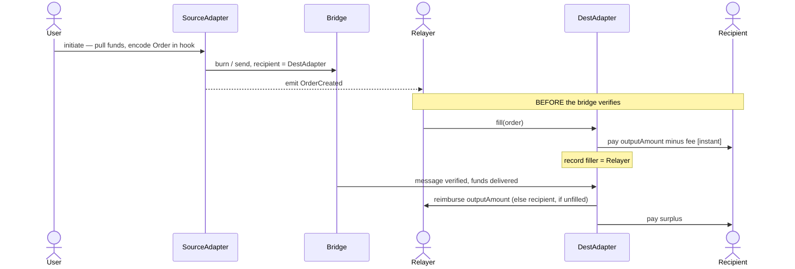
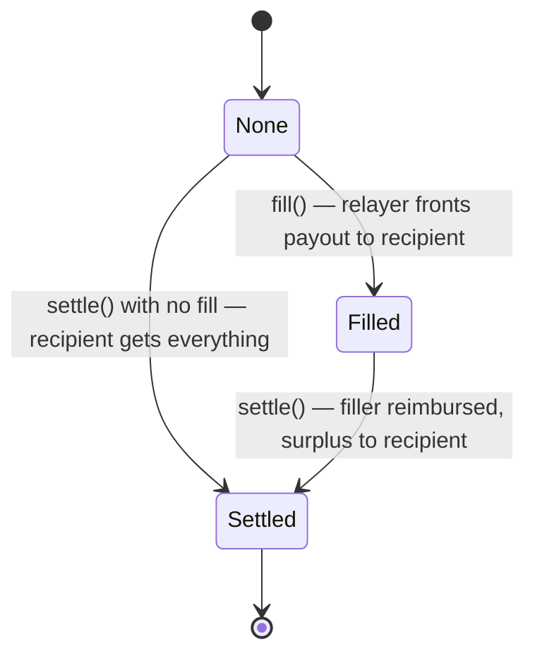
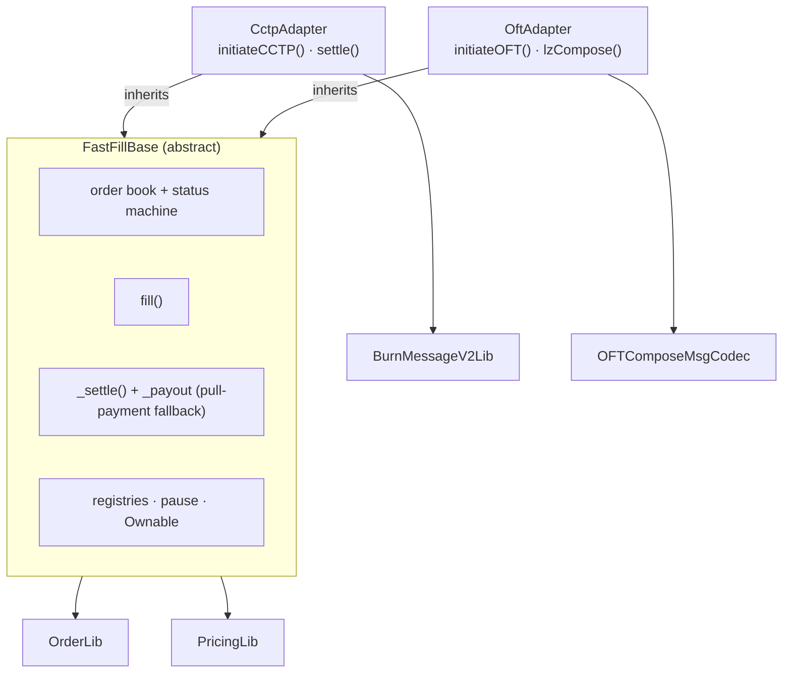

# fast-fill

A thin **optimistic fill** layer on top of message-based bridges (Circle **CCTP v2** and LayerZero **OFT**). It lets external relayers pre-pay a cross-chain transfer on the destination chain *before* the underlying bridge message is verified, for a small user-priced premium. When the bridge message finally settles, the bridged funds reimburse the relayer (if the order was filled) or flow straight to the recipient (if it was not).

- **Best case:** the user receives funds in seconds (relayer fills) instead of waiting for finality.
- **Worst case:** no relayer fills, and the user receives funds exactly when the underlying bridge would have delivered them — paying nothing extra.
- **No escrow, no relayer liquidity pool:** the in-flight bridged funds *are* the relayer's reimbursement.

> ✅ **Proven on mainnet.** The CCTP path has been run end-to-end on **Base ⇄ Arbitrum** with real USDC and Circle's real attestation service — full transaction record in **[DEMO.md](DEMO.md)**.

📖 **Docs:** [DEMO.md](DEMO.md) (live mainnet walkthrough) · [docs/ARCHITECTURE.md](docs/ARCHITECTURE.md) (design deep-dive with diagrams).

## How it works



**The load-bearing invariant.** `orderId = keccak256(abi.encode(order))` is computed identically at source-encode, at fill, and at settle. The order data settles through the bridge's *authenticated* channel, so a relayer that fills against a fabricated order computes an orderId no settling message will reproduce, and is simply never reimbursed. **Fills are trustless: a careless or malicious filler can only lose its own funds** — never the recipient's, the protocol's, or another filler's. That is why filling is permissionless by default.

Each order moves through a one-slot status machine:



## Pricing

The relayer's fee is largest right after the order's `startTime` (it fronts capital longest) and decays linearly to zero at `expectedDeliveryTime` — so a late or never-filled order costs the user nothing.

```
timeSaved = max(0, expectedDeliveryTime − max(fillTime, startTime))
rate      = min(discountRate · timeSaved, maxFeeRate)          [WAD]
fee       = outputAmount · rate / 1e18
payout    = outputAmount − fee        (paid to the recipient at fill)
```

`discountRate` is **per-order, user-chosen** (their speed/cost tradeoff); `maxFeeRate` is a **per-adapter governance cap**. The curve lives in [`PricingLib`](src/libraries/PricingLib.sol) and is trivial to swap.

## Architecture



```
src/
  FastFillBase.sol           abstract: order book, state machine, fill(), _settle(),
                               pull-payment fallback, pause, ownership, registries
  adapters/
    CctpAdapter.sol          initiateCCTP() + settle(message, attestation)
    OftAdapter.sol           initiateOFT() + lzCompose()  [ILayerZeroComposer]
  libraries/
    OrderLib.sol             Order struct + keccak256(abi.encode) hashing + encode/decode
    PricingLib.sol           the fee curve (WAD, capped, monotonic)
    BurnMessageV2Lib.sol     parse a CCTP v2 message (sourceDomain/messageSender/mintRecipient/...)
    OFTComposeMsgCodec.sol   decode a LayerZero OFT composed message
    AddressCast.sol          checked bytes32 <-> address
  interfaces/
    cctp/                    hand-written ^0.8 ITokenMessengerV2 / IMessageTransmitterV2
    layerzero/               hand-written ILayerZeroComposer / IOFT
    IFastFill.sol            shared external surface + events + order record types
```

The **CCTP** and **OFT** adapters are **deployed at separate addresses**, so the USDC reimbursement pool and the OFT-token pool are physically isolated — a decode/auth bug in one adapter can never reach the other's funds. Each adapter is **bidirectional**: it initiates outbound transfers and settles inbound ones, and is deployed on every supported chain.

### Settlement authentication

- **CCTP:** the source sets `mintRecipient = destinationCaller = the destination adapter`, so only that adapter can call `receiveMessage`. After it mints `amount − feeExecuted` USDC and consumes the CCTP nonce, the adapter additionally requires the burn's `messageSender` to be its **registered source adapter** — so a burn crafted by anyone else (with a forged order in `hookData`) can never be settled.
- **OFT:** `lzCompose` is gated by three checks — caller is the Endpoint, the local `from` OFT is ours, and the embedded `composeFrom` is our registered source adapter.

See [docs/ARCHITECTURE.md](docs/ARCHITECTURE.md) for the full CCTP/OFT authentication flows, the per-chain USDC handling, and the security model.

## Build & test

```bash
forge build
forge test                 # unit + integration (CCTP & OFT) + invariant
forge test --mt invariant -vvv
FOUNDRY_PROFILE=ci forge test
```

52 tests in total: pure-library unit + fuzz, full CCTP & OFT lifecycle, races, adversarial, invariants (16k+ calls), and **mainnet-fork** checks that run automatically when a mainnet RPC is available (otherwise they self-skip). Dependencies (git submodules under `lib/`): `forge-std`, `solady`.

### A note on dependencies

CCTP's reference contracts are pinned to `solidity 0.7.6` (not importable into this `^0.8` build), and wiring the LayerZero `devtools` monorepo into a standalone Foundry project is brittle. So the bridge interfaces and codecs here are **hand-written faithful mirrors** of the upstream signatures/byte-layouts (each file cites its source), and the bridges are simulated locally with faithful mocks under [`test/mocks`](test/mocks). Validation against the **real deployed contracts** lives in the fork tests, which resolve a mainnet RPC from `ETH_RPC_URL` or build one from `ALCHEMY_API_KEY`:

```bash
ALCHEMY_API_KEY=... FOUNDRY_PROFILE=fork forge test --match-path "test/fork/**" -vvv
```

`test/fork/CctpForkE2E.t.sol` does a **real** `depositForBurnWithHook` burn on a mainnet fork and validates our message parser + order encoding against the real emitted message — the dry-run that de-risked the live demo.

## Deploy

```bash
USDC=0x... forge script script/DeployCctpAdapter.s.sol --rpc-url $RPC --broadcast
OFT=0x...  forge script script/DeployOftAdapter.s.sol  --rpc-url $RPC --broadcast
```

After deploying an adapter on each chain, the owner wires the counterparts:

- **CCTP:** `setDomain(chainId, cctpDomain)` for the local and each remote chain, `setRemoteAdapter(remoteChainId, remoteAdapterAsBytes32)`, and `setRemoteUsdc(remoteChainId, remoteUsdcAddress)`.
- **OFT:** `setEid(chainId, lzEid)` similarly, then `setRemoteAdapter(...)`.

Canonical mainnet addresses, domains, and eids are in [`script/config/Addresses.sol`](script/config/Addresses.sol). A worked, on-chain example is in [DEMO.md](DEMO.md).

## Status

Prototype. Not audited. The pricing curve, surplus routing (currently → recipient), and relayer permissioning (currently permissionless, with an optional owner allowlist) are intended iteration points. The **OFT path** is proven in the local + fork harness; a live OFT demo (demo token + LayerZero peer/DVN wiring) is the next step.
