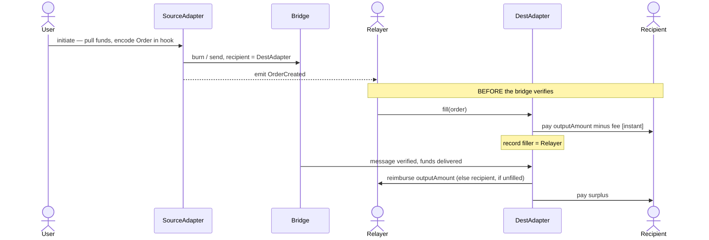
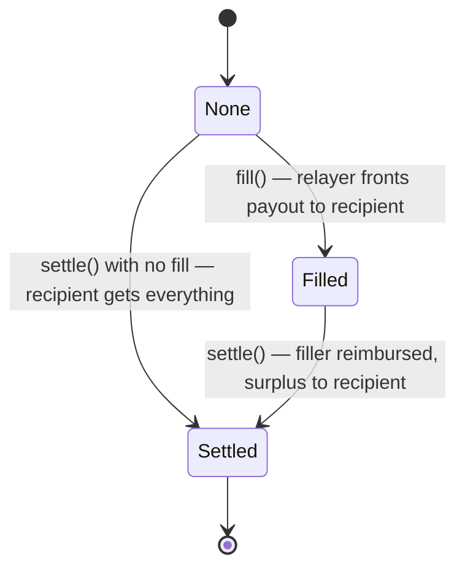
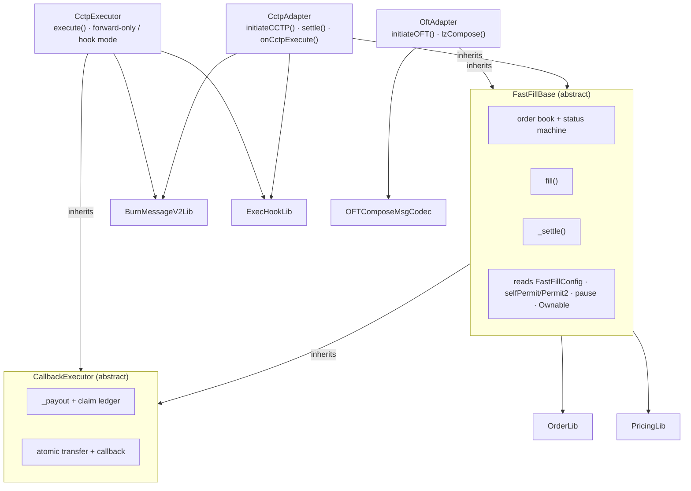

<p align="center">
  
</p>

# fast-fill

A thin **optimistic fill** layer on top of message-based bridges (Circle **CCTP v2** and LayerZero **OFT**). It lets external relayers pre-pay a cross-chain transfer on the destination chain *before* the underlying bridge message is verified, for a small user-priced premium. When the bridge message finally settles, the bridged funds reimburse the relayer (if the order was filled) or flow straight to the recipient (if it was not).

- **Best case:** the user receives funds in seconds (relayer fills) instead of waiting for finality.
- **Worst case:** no relayer fills, and the user receives funds exactly when the underlying bridge would have delivered them — paying nothing extra.
- **No escrow, no relayer liquidity pool:** the in-flight bridged funds *are* the relayer's reimbursement.
- **CCTP liveness option:** a user can add a `mintFee` so any third party is paid to relay the destination mint through the standalone `CctpExecutor`.

> ✅ **Proven on mainnet.** The CCTP path has been run end-to-end on **Base ⇄ Arbitrum** with real USDC and Circle's real attestation service — full transaction record in **[DEMO.md](DEMO.md)**.

📖 **Docs:** [DEMO.md](DEMO.md) (live mainnet walkthrough) · [docs/ARCHITECTURE.md](docs/ARCHITECTURE.md) (design deep-dive with diagrams) · [DEPLOYMENTS.md](DEPLOYMENTS.md) (live mainnet addresses on Base/OP/ARB) · [demo/](demo/README.md) (interactive web app) · [relayer/](relayer/README.md) (autonomous relayer bot).

## Repository layout

Three pieces — the contracts, an interactive demo, and a relayer bot:

| Path | What |
|---|---|
| [`src/`](src) | The fast-fill contracts — CCTP & OFT adapters, the `CctpExecutor`, the immutable config registry, and the supporting libraries. Detailed tree in [Architecture](#architecture) below. |
| [`demo/`](demo/README.md) | **Interactive Next.js app**, live on Arbitrum / Optimism / Base mainnet: connect a wallet, send a real (capped) transfer, and watch a backend relayer fill it on the destination in seconds. The easiest way to see fast-fill in action. |
| [`relayer/`](relayer/README.md) | **Autonomous Rust relayer bot** — watches `OrderCreated`, optimistically fills profitable orders, and relays CCTP mints through the executor for the `mintFee`. |
| [`script/`](script) · [`test/`](test) · [`docs/`](docs) | Foundry deploy scripts · the full test suite (unit / integration / fork / invariant) · design deep-dives ([architecture](docs/ARCHITECTURE.md), [gas](docs/GAS.md), [gateway](docs/GATEWAY.md)). |

## How it works



For CCTP there are two settlement modes. `mintFee == 0` keeps the legacy direct path: anyone calls
`CctpAdapter.settle(message, attestation)`. `mintFee > 0` routes the burn to `CctpExecutor` instead:
anyone calls `execute(message, attestation)`, earns `mintFee`, and the executor forwards the remaining
USDC to the adapter, which settles via `onCctpExecute`. The shared `Order` and `orderId` are unchanged.

**Batching & directed payout.** A relayer can bundle many mints into one transaction via
`executeBatch(messages[], attestations[], feeRecipient)` (and fills via `fillBatch(orders[], beneficiary)`)
with **partial success** — an item that reverts (already relayed/filled, stale attestation) is skipped,
not aborting the batch — and can direct its own `mintFee`/reimbursement to a chosen address
(`executeTo` / `fillTo`). These move only the relayer's own funds; the user-signed delivery target and
recipient stay authoritative.

**The load-bearing invariant.** `orderId = keccak256(abi.encode(order))` is computed identically at source-encode, at fill, and at settle. The order data settles through the bridge's *authenticated* channel, so a relayer that fills against a fabricated order computes an orderId no settling message will reproduce, and is simply never reimbursed. **Fills are trustless: a careless or malicious filler can only lose its own funds** — never the recipient's, the protocol's, or another filler's. That is why filling is permissionless by default.

Each order moves through a one-slot status machine:



## Pricing

The relayer's fee has two **additive** parts: an optional flat `baseFee` (a fixed price for the service, owed on any fill) and a time premium that is largest right after the order's `startTime` and decays linearly to zero at `expectedDeliveryTime` — so a late or never-filled order costs the user nothing beyond the bridge.

```
timeSaved = max(0, expectedDeliveryTime − max(fillTime, startTime))
rate      = min(discountRate · timeSaved, maxFeeRate)          [WAD]
timeFee   = outputAmount · rate / 1e18
fee       = min(baseFee + timeFee, outputAmount)
payout    = outputAmount − fee        (paid to the recipient at fill)
```

`baseFee` (output-token units, e.g. `10_000` = $0.01 USDC) and `discountRate` are **per-order, user-chosen** — set `baseFee = 0` for the pure time curve, or `discountRate = 0` for a flat fee; `maxFeeRate` is a **per-adapter governance cap** on the rate. Timing is **derived on-chain**: `startTime = block.timestamp` and the user signs a relative `deliveryWindow`, so `expectedDeliveryTime = block.timestamp + deliveryWindow` (the bridges expose no on-chain delivery-time getter). The curve lives in [`PricingLib`](src/libraries/PricingLib.sol) and is trivial to swap. Gas benchmarks — including the overhead fast-fill adds over a direct bridge call — are in [docs/GAS.md](docs/GAS.md).

## Architecture



```
src/
  FastFillBase.sol           abstract: order book, state machine, fill()/fillFor(), _settle(),
                               selfPermit + Permit2 pulls, pause, ownership
  CallbackExecutor.sol        abstract: pull-payment fallback, claim(), atomic transfer+hook execution
  CctpExecutor.sol            permissionless CCTP mint-relay + USDC forward / hook executor
  config/
    FastFillConfig.sol       immutable CREATE2 chain registry (the single source of chain config)
  adapters/
    CctpAdapter.sol          initiateCCTP[For]() + settle(message, attestation) + onCctpExecute(...)
    OftAdapter.sol           initiateOFT[For]() + lzCompose()  [ILayerZeroComposer]; one instance per OFT (oftId)
    OftAdapterFactory.sol    deploy(oftId) -> a deterministic OftAdapter per OFT (shared config/owner/fee baked in)
  libraries/
    OrderLib.sol             Order struct + keccak256(abi.encode) hashing + encode/decode
    PricingLib.sol           the fee curve (WAD, capped, monotonic)
    PermitLib.sol            Permit2 order-intent / fill-auth witnesses + type strings
    BurnMessageV2Lib.sol     parse a CCTP v2 message (sourceDomain/messageSender/mintRecipient/...)
    ExecHookLib.sol          CctpExecutor envelope encode/decode (mintFee, target, gasLimit, refundTo, payload)
    OFTComposeMsgCodec.sol   decode a LayerZero OFT composed message
    OftId.sol                stable per-OFT ids (USD₮0=0, USDe=1, sUSDe=2, ENA=3, USDtb=4)
    AddressCast.sol          checked bytes32 <-> address
  interfaces/
    cctp/                    hand-written ^0.8 ITokenMessengerV2 / IMessageTransmitterV2
    layerzero/               hand-written ILayerZeroComposer / IOFT / ILayerZeroEndpointV2
    permit2/                 ISignatureTransfer (Permit2)
    IERC20Permit.sol         EIP-2612
    IFastFillConfig.sol      ChainConfig + OftDeployment + registry interface (chainConfig + oftConfig)
    IFastFill.sol            shared external surface + events + order record types
    IFastFillReceiver.sol    onFastFill destination-execution callback (+ RedirectFunds)
    ICctpExecReceiver.sol    onCctpExecute callback for CctpExecutor hook-mode users
```

The **CCTP** adapter and each **OFT** adapter are **deployed at separate addresses**. The OFT adapter is generic — parameterized by an `oftId` — so there is one instance per OFT (USD₮0, USDe, sUSDe, ENA, USDtb), each minted by `OftAdapterFactory` at a deterministic, cross-chain-stable address. Every token's reimbursement pool is therefore physically isolated — a decode/auth bug in one adapter can never reach another's funds. Each adapter is **bidirectional**: it initiates outbound transfers and settles inbound ones, and is deployed on every supported chain.

### Settlement authentication

Each adapter is CREATE2-deterministic, so its counterpart on every chain is **the same address — `address(this)`**:

- **CCTP direct:** when `mintFee == 0`, the source sets `mintRecipient = destinationCaller = address(this)`, so only this adapter can call `receiveMessage`. After it mints `amount − feeExecuted` USDC and consumes the CCTP nonce, it additionally requires the burn's `messageSender == address(this)` — so a burn crafted by anyone else (with a forged order in `hookData`) can never be settled.
- **CCTP Executor:** routed orders set `mintRecipient = destinationCaller = cctpExecutor`. The executor consumes the CCTP message, pays `mintFee` to `msg.sender`, then forwards `amount − feeExecuted − mintFee` and the authenticated `sourceDomain`/`messageSender` to the adapter's `onCctpExecute`. The adapter applies the same source-domain + sender authentication as `settle`.
- **OFT:** `lzCompose` is gated by three checks — caller is the Endpoint, the local `from` OFT is the one in the registry, and the embedded `composeFrom == address(this)`.

See [docs/ARCHITECTURE.md](docs/ARCHITECTURE.md) for the full CCTP/OFT authentication flows, the per-chain USDC handling, and the security model.

## Build & test

```bash
forge build
forge test                 # unit + integration (CCTP & OFT) + invariant
forge test --mt invariant -vvv
FOUNDRY_PROFILE=ci forge test
```

141 tests in total: pure-library unit + fuzz (incl. the flat-base-fee + time-decay pricing curve), full CCTP & OFT lifecycle (the entire OFT lifecycle is **re-run verbatim against a non-USD₮0 adapter** to prove it is OFT-agnostic), the **CCTP Executor** (routed settlement, standalone forward-only and hook modes, mutual exclusivity, blacklisted relayer retry, claw-back, refund claimant), the **OFT factory** (deterministic per-`oftId` addresses + pool isolation), races, adversarial, invariants (16k+ calls, now fuzzing the base fee too), gasless approval flows, **destination executions** (success / redirect / claimable / reentrancy / return-bomb / gas-budget / atomic claw-back, both bridges), gas benchmarks (`test/gas/` — see [docs/GAS.md](docs/GAS.md)), and **mainnet-fork** checks that run automatically when an RPC is available (otherwise they self-skip) — including an **Optimism fork end-to-end against the real USD₮0 OFT** (proves USD₮0 forwards our compose, mints, settles), **live fact checks for the Ethena OFTs** (USDe / sUSDe / ENA / USDtb — `OFT.token()`/`endpoint()`/topology/decimals verified against the registry on Ethereum, Optimism, Arbitrum, and Base), and a **fork against the real Permit2** (proves a sponsored intent's signature + witness binding, including rejected recipient- and bridge-mode-tampering). Dependencies (git submodules under `lib/`): `forge-std`, `solady`.

### A note on dependencies

CCTP's reference contracts are pinned to `solidity 0.7.6` (not importable into this `^0.8` build), and wiring the LayerZero `devtools` monorepo into a standalone Foundry project is brittle. So the bridge interfaces and codecs here are **hand-written faithful mirrors** of the upstream signatures/byte-layouts (each file cites its source), and the bridges are simulated locally with faithful mocks under [`test/mocks`](test/mocks). Validation against the **real deployed contracts** lives in the fork tests, which resolve a mainnet RPC from `ETH_RPC_URL` or build one from `ALCHEMY_API_KEY`:

```bash
ALCHEMY_API_KEY=... FOUNDRY_PROFILE=fork forge test --match-path "test/fork/**" -vvv
```

`test/fork/CctpForkE2E.t.sol` does a **real** `depositForBurnWithHook` burn on a mainnet fork and validates our message parser + order encoding against the real emitted message — the dry-run that de-risked the live CCTP demo. `test/fork/OftForkE2E.t.sol` does the OFT analogue on an **Optimism** fork: it deploys the adapter against the real USD₮0 OFT + endpoint, drives the real `oft.lzReceive` (which mints real USD₮0 to the adapter and forwards our compose), then drives the real `endpoint.lzCompose` into the adapter to settle — proving the destination path before any live funds. `test/fork/EthenaOftFork.t.sol` verifies the registry's USDe / sUSDe / ENA / USDtb rows against the **live** OFTs on Ethereum, Optimism, Arbitrum, and Base (`OFT.token()`/`endpoint()`, native-vs-adapter topology, decimals) — the address-correctness gate for the new OFTs. Resolve OP/ARB/Base RPCs from `OP_RPC_URL`/`ARB_RPC_URL`/`BASE_RPC_URL` or `ALCHEMY_API_KEY`.

## Deploy

All chain-specific data (CCTP/LZ addresses, domains, eids, per-chain USDC, and each OFT's per-chain `(oft, token)` for USD₮0 / USDe / sUSDe / ENA / USDtb) lives in one immutable [`FastFillConfig`](src/config/FastFillConfig.sol) registry. Deploy it **once via CREATE2** so it lands at the same address on every chain, then deploy each adapter with that address — **there is no per-counterpart wiring to get wrong.**

```bash
# 1. Deploy the registry (same EOA + salt on every chain => same address everywhere)
forge script script/DeployFastFillConfig.s.sol --rpc-url $RPC --broadcast

# 2. Deploy the CCTP executor, then the CCTP adapter + OFT factory against the same config.
CONFIG=0x... forge script script/DeployCctpExecutor.s.sol       --rpc-url $RPC --broadcast
CONFIG=0x... EXECUTOR=0x... forge script script/DeployCctpAdapter.s.sol --rpc-url $RPC --broadcast
CONFIG=0x... forge script script/DeployOftAdapterFactory.s.sol  --rpc-url $RPC --broadcast

# 3. Deploy the configured OFT adapters via the factory (USD₮0, sUSDe, USDe, ENA)
FACTORY=0x... forge script script/DeployOftAdapter.s.sol --rpc-url $RPC --broadcast
```

Because the registry, the executor address, the owner, and the fee cap are identical across chains, the CCTP adapter is **CREATE2-deterministic** — the same address everywhere — so the counterpart adapter is simply `address(this)`. The executor is also CREATE2-deterministic and shared by all CCTP users. The adapter resolves every value from the registry at call time, and **cross-checks the local domain/eid/token against the live bridge contracts on each use**, reverting on any mismatch (a wrong constant cannot silently ship). Adding a chain means publishing a new registry version; there are no owner setters for addresses. The canonical addresses are in [`FastFillConfig`](src/config/FastFillConfig.sol) (with a `script/config/Addresses.sol` mirror used only by tests/scripts, bound to the registry by a consistency test). A worked CCTP example is in [DEMO.md](DEMO.md).

## Gasless & sponsored transfers

Both adapters support signature-based funding so a user (or relayer) need only **sign**, not send:

- **EIP-2612 single-tx** (self-submitted): batch a `selfPermit` before the action — `multicall([selfPermit(token, …), initiateCCTP(…)])` — so the approval and the bridge land in one transaction. Works for USDC and USD₮0 (both support `permit`).
- **Permit2 sponsored intent** (`initiate*For` / `fillFor`): a user signs an off-chain bridge intent and hands it to relayers; a relayer submits it and pays gas, while the funds are pulled from the **signer** via Permit2 and the signer is recorded as the order's sender. The Permit2 signature commits to a **witness** (the order intent / the orderId), so the submitter cannot alter the recipient, amounts, timing, pricing, the bridge mode (CCTP fast/slow via `minFinalityThreshold`+`maxFee` and executor routing via `mintFee`; OFT executor options, bound as a `bridgeParams` hash), **or the destination execution** (`hookData` + `callbackGasLimit`). Proven against the real Permit2 in [`test/fork/PermitFork.t.sol`](test/fork/PermitFork.t.sol), including rejected attempts to tamper with the recipient and to flip the bridge speed.

## Destination executions

Initiate calls take `recipient` as `bytes32` for bridge compatibility, but it must be the canonical bytes32 form of an EVM address (`address.toBytes32()`, upper 12 bytes zero) and cannot be zero.

An order can carry **`hookData`** (and a user-signed **`callbackGasLimit`**, capped at **5,000,000 gas**): when the funds are delivered — whether by a relayer's optimistic fill or by the bridge settling — a recipient *contract* receives an [`IFastFillReceiver.onFastFill(orderId, token, amount, hookData)`](src/interfaces/IFastFillReceiver.sol) callback in the **same atomic frame** as the transfer. Empty `hookData` (or an EOA recipient) ⇒ funds delivered, no call. The same interface serves both adapters.

The callback is **gas-capped** (`{gas: callbackGasLimit}`, return-bomb-safe, behind the existing `nonReentrant` guard — a receiver cannot re-enter or grief the fill). The forwarded budget is **guaranteed**: an exact in-frame check (covering both nested EIP-150 63/64 deductions) means a committed fill always delivered the receiver its full signed `callbackGasLimit` — a relayer that under-funds the transaction reverts the whole fill (forcing a retry) rather than starving the callback into the claim ledger. And **funds are never stuck**: the receiver's own revert data governs the fallback.

```
onFastFill succeeds            → funds delivered, execution ran
reverts RedirectFunds(dest)    → funds delivered to dest instead
reverts anything else / OOG    → funds credited to claimable[recipient] (recover via claim())
```

This mirrors CCTP v2's atomic hook semantics but is **strictly safer** — a deterministically-failing hook can never strand the bridged funds. Tested across both bridges in [`test/integration/DestinationExecution.t.sol`](test/integration/DestinationExecution.t.sol) (success, redirect, claimable, reentrancy, return-bomb, gas-budget, atomic claw-back).

## Status

Prototype. Not audited. Surplus routing (currently → recipient) is an intended iteration point. Pricing is **user-flexible**: a flat `baseFee`, a time-decay premium, or both, with timing derived on-chain from a signed relative `deliveryWindow`. The **bridge mode** is the user's choice and is signed over in sponsored flows — CCTP fast vs finalized (`minFinalityThreshold` + `maxFee`) plus optional executor routing (`mintFee`); OFT executor options (`extraOptions`). Orders can attach a **destination execution** (`hookData` + signed `callbackGasLimit`) delivered via [`IFastFillReceiver.onFastFill`](src/interfaces/IFastFillReceiver.sol) atomically with the funds, with receiver-governed failure routing (deliver / redirect / claimable). A **Circle Gateway** relayer-funding path is designed (relayers mint just-in-time from a unified balance) but not yet built — see [docs/GATEWAY.md](docs/GATEWAY.md). Filling is **permissionless** — anyone may fill, since the `orderId` invariant makes a fill against a fabricated order self-punishing. Config is an **immutable CREATE2 registry** (deterministic adapter/executor addresses, no per-deploy wiring); users and relayers can act via **EIP-2612 or Permit2 signatures** (single-tx or sponsored). The **CCTP direct path** is proven live on Base ⇄ Arbitrum; the **CctpExecutor routed path** is deployed on Base, Optimism, and Arbitrum and live-smoke-tested for unfilled and optimistically filled orders. The **OFT path** targets **USD₮0** and is proven against the real USD₮0 OFT + LayerZero endpoint on an Optimism fork (compose forwarding + real mint + settle); a live USD₮0 demo is the next step.
