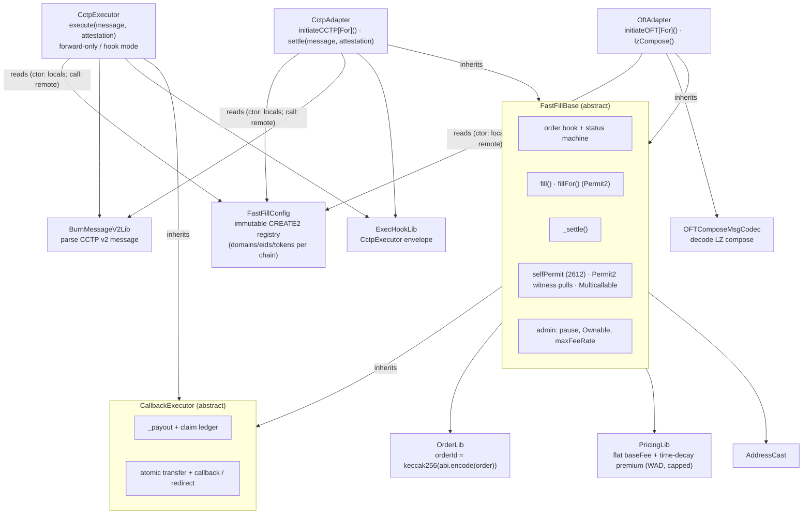
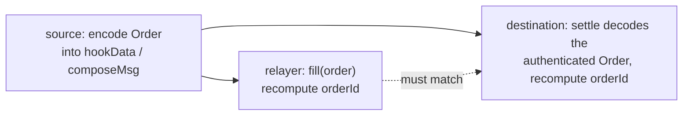
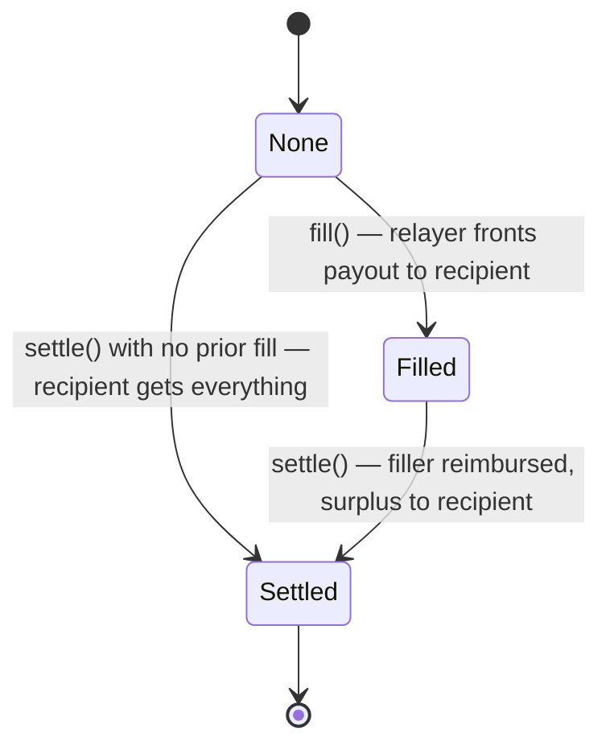
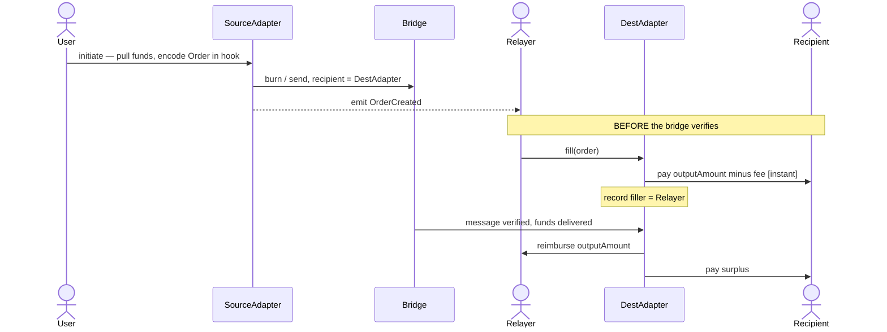
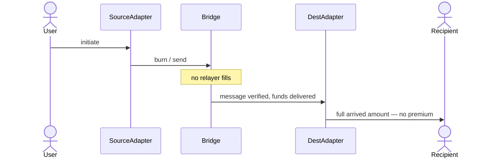
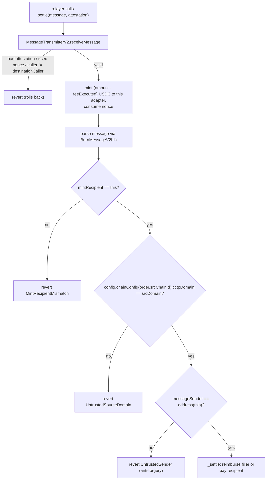
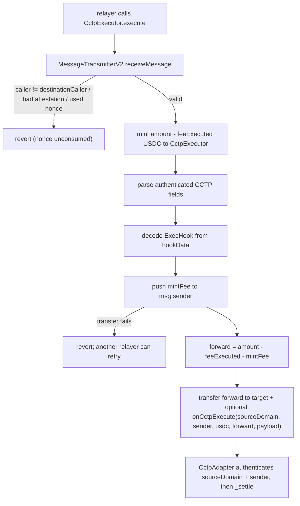
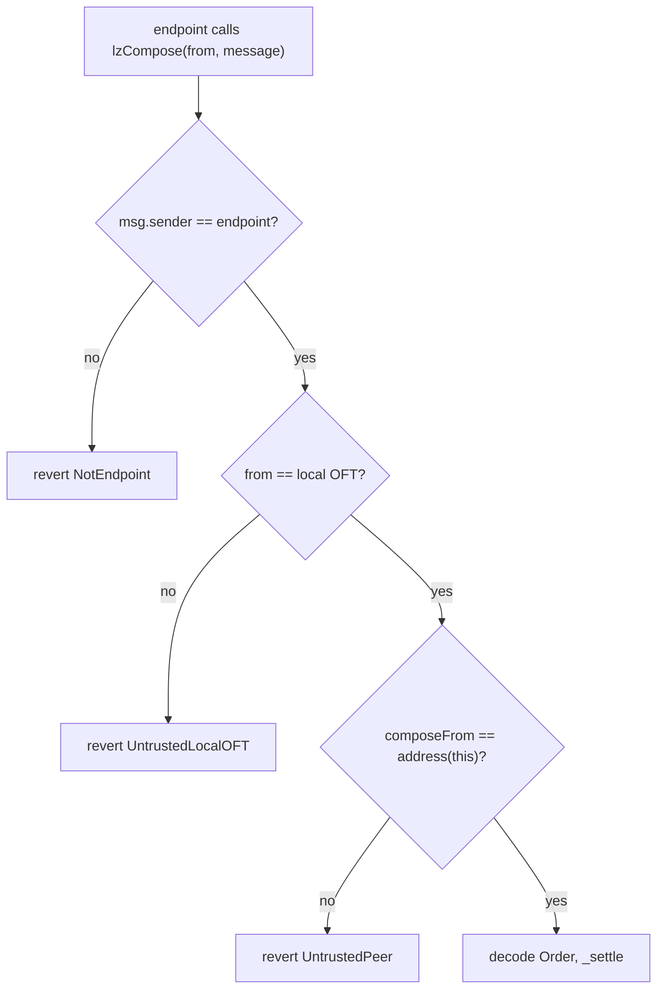
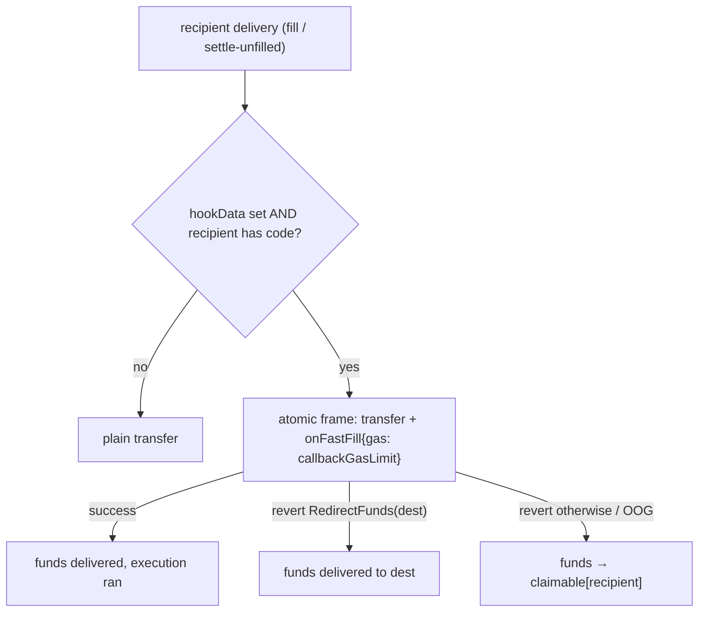

# fast-fill — Architecture

fast-fill is a thin **optimistic-fill layer** over message-based bridges (Circle **CCTP v2** and
LayerZero **OFT**). It lets external relayers pre-pay a cross-chain transfer on the destination
chain *before* the underlying bridge message is verified, in exchange for a small, user-priced
time premium. When the bridge message finally settles, the bridged funds reimburse the relayer (if
the order was filled) or flow straight to the recipient (if it was not).

- **Best case:** the user receives funds in seconds (a relayer fills).
- **Worst case:** the user receives funds exactly when the underlying bridge would have delivered
  them — and pays nothing extra.
- **No escrow, no relayer liquidity pool:** the in-flight bridged funds *are* the relayer's
  reimbursement.

---

## 1. Contract topology



Every adapter is **deployed at its own address**, so each token's reimbursement pool is physically
isolated — a decode/auth bug in one adapter can never reach another's funds. There is one
`CctpAdapter` (USDC) and one `OftAdapter` **per OFT** — the OFT adapter is parameterized by an
`oftId` (USD₮0, USDe, sUSDe, ENA, USDtb, …) and the `OftAdapterFactory` stamps out a new instance
per id at a deterministic, cross-chain-stable address. All shared lifecycle logic lives once in the
`abstract` base (inlined at compile time, no extra call cost). Each adapter is **bidirectional**: it
initiates outbound transfers *and* settles inbound ones, and is deployed on every supported chain.

| Contract | Responsibility |
|---|---|
| `CallbackExecutor` | Shared transfer+callback substrate: `_payout` fallback, `claim`/`claimable`, atomic transfer+hook execution, redirect parsing, return-data bounding, callback gas checks |
| `FastFillBase` | Order book, status machine, `fill`/`fillFor`, `_settle`, fast-fill destination-execution callback (`onFastFill`), pricing call, pause, ownership, EIP-2612 `selfPermit` + Permit2 pulls + `Multicallable` |
| `FastFillConfig` | Immutable CREATE2 chain registry — per-chain CCTP/LZ transport (`chainConfig`) plus each OFT's `(oft, token)` keyed by `(chainId, oftId)` (`oftConfig`); the single source the adapters read — LOCAL config once at construction (cached as immutables), REMOTE config per call |
| `CctpAdapter` | `initiateCCTP`/`initiateCCTPFor` (burn-with-hook), direct `settle(message, attestation)`, routed `onCctpExecute(...)` from `CctpExecutor` |
| `CctpExecutor` | Generic permissionless CCTP mint-relay: consumes executor-routed CCTP messages (single `execute`/`executeTo` or partial-success `executeBatch`), pays `mintFee` to the caller or a caller-named recipient, forwards USDC to a recipient or calls `onCctpExecute` on a receiver |
| `OftAdapter` | One per OFT (selected by `oftId`): `initiateOFT` (`send` with `composeMsg`) and `lzCompose` (LayerZero compose callback) |
| `OftAdapterFactory` | `deploy(oftId)` — CREATE2-stamps an `OftAdapter` for an OFT at a deterministic, cross-chain-stable address (shared `config`/`owner`/`maxFeeRate` baked in) |
| `OftId` | Stable numeric ids per OFT (USD₮0=0, USDe=1, sUSDe=2, ENA=3, USDtb=4) — append-only |
| `OrderLib` | The `Order` struct and its canonical hash / encode / decode |
| `PricingLib` | The time-decay fee curve (pure) |
| `BurnMessageV2Lib` | Parse the fields fast-fill needs from a CCTP v2 message |
| `ExecHookLib` | Encode/decode the `CctpExecutor` envelope: `mintFee`, `target`, `gasLimit`, `refundTo`, `payload` |
| `OFTComposeMsgCodec` | Decode a LayerZero OFT composed message |
| `AddressCast` | Checked `bytes32 ↔ address` |

---

## 2. The load-bearing invariant: `orderId`

```
orderId = keccak256(abi.encode(order))
```

The same `orderId` is computed in three places:



Because the order data settles through the bridge's **authenticated channel** (a Circle-attested
message or a LayerZero-verified compose), a relayer that fills against a *fabricated* order computes
an `orderId` that no settling message will ever reproduce — so that relayer is simply never
reimbursed. **Fills are therefore trustless from the protocol's perspective: a careless or
malicious filler can only lose its own funds, never the recipient's, the protocol's, or another
filler's.** This is why filling is permissionless by default.

---

## 3. Order lifecycle



- `fill` requires `status == None` (rejects double-fill and fill-after-settle).
- `settle` requires `status != Settled` (the bridge's own nonce is the first, independent replay
  guard; this app-level check is defense-in-depth).
- `Settled` is terminal. The destination contract's balance is the reimbursement pool, and every
  order settles exactly once.

The record packs into one storage slot:

```solidity
struct OrderRecord { address filler; FillStatus status; uint40 fillTime; }
```

---

## 4. The two flows

### 4a. Optimistic fill (best case)



The relayer's entrypoints have batch and directed-payout variants: **`fillTo(order, beneficiary)`** funds
the payout from `msg.sender` but records `beneficiary` as the filler reimbursed at settle, and
**`fillBatch(orders[], beneficiary)`** fills many in-flight orders in one transaction with partial success
(an order that reverts — already filled, wrong chain — is skipped, not aborting the batch; `filled[i]`
reports each). Neither redirects the payout away from the user-signed `recipient` — they only direct the
relayer's own reimbursement. (`CctpExecutor` has the analogous `executeTo` / `executeBatch` — §7.)

### 4b. No fill (worst case = same as the bridge alone)



---

## 5. Pricing

The fee a relayer earns has two **additive** parts: an optional flat `baseFee` owed on any fill, and a
time premium that is largest right after `startTime` (the relayer fronts capital longest) and decays
linearly to zero at `expectedDeliveryTime`. A late or never-filled order costs the user nothing beyond
the bridge.

```
timeSaved = max(0, expectedDeliveryTime - max(fillTime, startTime))
rate      = min(discountRate * timeSaved, maxFeeRate)          [WAD]
timeFee   = outputAmount * rate / 1e18
fee       = min(baseFee + timeFee, outputAmount)
payout    = outputAmount - fee     (paid to the recipient at fill time)
```

- `baseFee` is **per-order, user-chosen**, in output-token units (e.g. `10_000` = $0.01 USDC). It lets
  a user pay a fixed price for the relaying service regardless of timing. `baseFee == 0` is the pure
  time curve; `discountRate == 0` is a pure flat fee. It is validated `< outputAmount` at create time,
  and the combined fee is capped at `outputAmount` so the recipient payout never underflows.
- `discountRate` is **per-order, user-chosen** (the time-premium accrual per second).
- `maxFeeRate` is a **per-adapter governance cap** on the *rate* (`<= 1e18`); `baseFee` is uncapped by
  governance — it is the user's own choice, like `discountRate`.
- The curve is a standalone pure library (`PricingLib`) — monotonic in fill time, capped, overflow-safe.

**Timing is derived on-chain.** Both `startTime` and `expectedDeliveryTime` are set by the contract:
`startTime = block.timestamp`, and the user supplies a **relative `deliveryWindow`** (seconds) from
which `expectedDeliveryTime = block.timestamp + deliveryWindow`. The bridges expose no on-chain
"expected delivery time" getter, so the window is the user's estimate (off-chain clients seed a sane
default from known bridge latencies). Signing a *relative* window — rather than an absolute timestamp —
means the window the user agreed to holds no matter when a sponsoring relayer actually submits.

The demo and relayers now choose default signed pricing values from factual inputs: gas benchmarks,
live destination gas price, ETH/USD, Circle CCTP fees, and a 10% APR capital-cost assumption. See
[`docs/PRICING.md`](./PRICING.md) for the off-chain quote model and relayer enforcement rules.

---

## 6. CCTP v2 integration

**Source.** `initiateCCTP` pulls USDC, builds the `Order`, and calls
`TokenMessengerV2.depositForBurnWithHook`. The user supplies two distinct CCTP costs:

- `maxFee`: Circle's fast-transfer fee cap. CCTP may execute with `feeExecuted <= maxFee`.
- `mintFee`: optional USDC paid to whoever relays the destination mint through `CctpExecutor`.

The fast-fill `Order` intentionally does **not** grow a `mintFee` field. Instead,
`outputAmount = inputAmount - maxFee - mintFee`, and `mintFee` lives only in the CCTP executor
envelope when used. This keeps `Order`, `orderId`, and the OFT path unchanged.

There are two CCTP source branches:

| `mintFee` | CCTP `mintRecipient` | CCTP `destinationCaller` | `hookData` | Destination entrypoint |
|---:|---|---|---|---|
| `0` | `CctpAdapter` | `CctpAdapter` | `OrderLib.encode(order)` | `CctpAdapter.settle` |
| `> 0` | `CctpExecutor` | `CctpExecutor` | `ExecHookLib.encode(ExecHook{...})` | `CctpExecutor.execute` → `CctpAdapter.onCctpExecute` |

The direct branch is the original proven path. The routed branch adds a relayer incentive for the
otherwise-unpaid CCTP destination mint.

**Destination, direct (`mintFee == 0`).** Settlement is atomic and authenticated:



Because the source sets `destinationCaller` to the destination adapter, **only that adapter can call
`receiveMessage`**, so the mint and the settlement are one atomic transaction. The extra
`messageSender == address(this)` check is critical anti-forgery: the adapter is CREATE2-deterministic,
so its counterpart on every chain is the *same address*. Anyone can craft their own CCTP burn to our
adapter with a fabricated order in `hookData`, but they cannot make the burn's `messageSender` be our
adapter address — so such a burn can never be settled here (which would otherwise let an attacker
pre-settle a real order's id and strand the genuine transfer).

**Per-chain USDC.** USDC has a *different address on every chain*, so the source stamps
`order.outputToken` with the **destination's** USDC, resolved from `config.chainConfig(dstChainId).usdc`;
the destination checks `order.outputToken` against its own `config.chainConfig(block.chainid).usdc`.
(This was a real bug surfaced by the live mainnet run — the single-token unit tests had masked it.)

**Bridge mode (user-chosen, signed).** The user picks the transfer speed via `minFinalityThreshold`
(`FINALITY_FAST = 1000` → a fast soft-finality transfer, charging up to `maxFee`; `FINALITY_FINALIZED
= 2000` → wait for hard finality, set `maxFee = 0`) and the fast-fee budget via `maxFee`. fast-fill
deliberately does **not** use Circle's auto-relay/forwarding: it sets `destinationCaller =
address(this)` so only this adapter can call `receiveMessage`, which keeps the mint and the
optimistic-fill reconciliation in one atomic transaction (and stops a griefer from consuming the
message nonce without running `_settle`). Direct settlement is therefore **permissionless but
adapter-mediated** — anyone may relay the `settle` call, but there is no built-in economic incentive.
Both bridge-speed knobs are the user's: their own tx in the self-submitted path, and bound into the
signature (`bridgeParams`) in the sponsored path.

**Destination, routed (`mintFee > 0`).** A third party calls `CctpExecutor.execute(message,
attestation)` instead of `CctpAdapter.settle`:



Accounting for fast-fill is unchanged:

```
forward - outputAmount
= (inputAmount - feeExecuted - mintFee) - (inputAmount - maxFee - mintFee)
= maxFee - feeExecuted >= 0
```

So the filler is still reimbursed exactly `outputAmount`, and the recipient's surplus is still
`maxFee - feeExecuted`. `mintFee` cancels because it is reserved on the source side and removed before
adapter settlement.

The routed path preserves the anti-grief property of the direct path: the CCTP message can only be
consumed by `CctpExecutor` (`destinationCaller = executor`), and the adapter still rejects a payload
unless the authenticated CCTP `messageSender == address(this)`.

CCTP interfaces are hand-written `^0.8` mirrors (`ITokenMessengerV2`, `IMessageTransmitterV2`)
because Circle's reference contracts are pinned to solc `0.7.6` and can't be imported here.

---

## 7. `CctpExecutor` as a standalone primitive

`CctpExecutor` is deliberately generic. It knows about CCTP messages, USDC, and its own envelope; it
knows nothing about fast-fill orders. Any CCTP integrator can use it as a permissionless mint relay:

1. On the source chain, call `depositForBurnWithHook` with:
   - `mintRecipient = address(CctpExecutor)` encoded as bytes32.
   - `destinationCaller = address(CctpExecutor)` encoded as bytes32.
   - `hookData = ExecHookLib.encode(envelope)`.
2. On the destination chain, anyone calls `CctpExecutor.execute(message, attestation)` (or `executeTo` /
   `executeBatch` — see "Batched relay & directed fee" below).
3. The executor mints USDC to itself via CCTP, pays `envelope.mintFee` to the relayer (or a caller-named
   fee recipient), and routes the rest according to the envelope.

The envelope is:

```solidity
struct ExecHook {
    uint256 mintFee;  // USDC paid to whoever calls execute()
    bytes32 target;   // forward recipient OR hook receiver contract
    uint64 gasLimit;  // 0 => forward-only, >0 => call target.onCctpExecute(...)
    bytes32 refundTo; // claimant if hook execution fails without RedirectFunds
    bytes payload;    // integrator-defined data
}
```

### Forward-only mode

Set `gasLimit = 0`. The executor transfers `amount - feeExecuted - mintFee` USDC to `target` and makes
no callback. This is the public-good replacement for "please redeem this CCTP message and send the
USDC to this address", with an optional relayer fee.

### Hook mode

Set `gasLimit > 0` and make `target` implement:

```solidity
function onCctpExecute(
    uint32 sourceDomain,
    bytes32 sender,
    address usdc,
    uint256 amount,
    bytes calldata payload
) external;
```

The executor transfers USDC to `target`, then calls that function in the **same atomic frame**. A
receiver must authenticate `msg.sender == CctpExecutor`; the only trustworthy provenance arguments are
`sourceDomain` and `sender`, because those are parsed from Circle's attested CCTP message. The
`payload` is arbitrary integrator data and is not trusted unless the receiver authenticates the CCTP
source.

Hook failures are handled by the shared `CallbackExecutor` machinery:

- `onCctpExecute` succeeds: target keeps the funds and execution ran.
- It reverts `RedirectFunds(dest)`: funds are delivered to `dest`.
- It reverts otherwise or runs out of gas: funds are credited to `claimable[refundTo][usdc]`.

The executor rejects `refundTo == address(CctpExecutor)` so funds cannot be credited to an
unclaimable self-ledger. If the relayer's `mintFee` push fails (for example the relayer is USDC
blacklisted), the whole `execute` reverts and the CCTP nonce remains redeemable by someone else.

### How fast-fill uses it

For a routed fast-fill order, the adapter builds:

```solidity
ExecHook({
    mintFee: mintFee,
    target: address(CctpAdapter).toBytes32(),
    gasLimit: order.callbackGasLimit + SETTLE_GAS_OVERHEAD,
    refundTo: order.recipient,
    payload: OrderLib.encode(order)
})
```

The adapter always sets `gasLimit > 0`, because the hook is what calls `onCctpExecute` and settles the
order. A forward-only executor envelope is useful for standalone integrations, but would skip
fast-fill settlement if used for an adapter order.

### Batched relay & directed fee

CCTP v2 has no on-chain batch mint — `receiveMessage` takes one message — so a relayer optimizes gas by
batching the *calls*, not the mint. Two extra entrypoints support this:

- **`executeTo(message, attestation, feeRecipient)`** — a single relay that pays the `mintFee` to a
  caller-named `feeRecipient` (`address(0)` => `msg.sender`), e.g. a hot wallet relays while a treasury
  collects the fee.
- **`executeBatch(messages[], attestations[], feeRecipient)`** — relay many messages in one transaction
  (amortizing the per-transaction base cost and reading the registry once), earning the sum of their
  `mintFee`s. Each item runs in its own `try`/`catch` self-call under the batch's single `nonReentrant`
  guard, so an item that reverts (already relayed, stale attestation, an under-funded hook, …) is
  **skipped** — it rolls back fully (its CCTP nonce stays unconsumed, so it is retryable) while the rest
  still execute. `filled[i]` reports per-item success and `BatchItemSkipped` is emitted for the others.
  Unlike `multicall`, a single bad item never aborts the batch.

Only the relayer's **own** `mintFee` is caller-directed; the delivery `target` and `refundTo` come from
the source-attested envelope and are never caller-controlled, so no caller can redirect the bridged USDC.
(`FastFillBase` has the symmetric `fillTo` / `fillBatch` — §4.)

---

## 8. LayerZero OFT integration

**Many OFTs, one code path.** `OftAdapter` is generic: it is constructed for a single `oftId` and
resolves its OFT entrypoint + ERC20 from `config.oftConfig(block.chainid, oftId)`. Onboarding a new
OFT (USDe, sUSDe, ENA, USDtb, …) is therefore additive — add the per-chain rows to `FastFillConfig`,
assign an `OftId`, and `OftAdapterFactory.deploy(oftId)` — with **no new adapter code**. Each `oftId`
is a separate deployment at its own address (isolated pool), and because the factory bakes identical
args and salts by `oftId`, that address is the **same on every chain** — which is exactly what the
`composeFrom == address(this)` gate below requires. The OFT topology is handled uniformly: a *native*
OFT has `oft == token`, an *adapter/lockbox* OFT (typically the home chain) has `oft != token`; the
adapter always holds the configured ERC20, approves it to the OFT, and cross-checks `OFT.token()`
against the registry, so both shapes work without special-casing.

**Source.** `initiateOFT` pulls the OFT token and calls `OFT.send` with the order in `composeMsg`
and `to == address(this)` (our adapter on the dst chain — the same CREATE2 address). `outputAmount =
minAmountLD`.

**Destination.** The OFT credits the bridged tokens to the adapter during `_lzReceive`; then the
endpoint invokes `lzCompose`, which is authenticated by **three gates**:



This is the OFT analogue of CCTP's `destinationCaller` + `messageSender` checks: `composeFrom`
(embedded in the verified message) must be our adapter's own address (`address(this)`, the same on
every chain). LayerZero's `OFTComposeMsgCodec` layout is mirrored locally.

**Bridge mode (executor).** Unlike CCTP, an OFT has **no per-transaction fast/slow switch** — delivery
speed is the pathway's DVN/confirmation configuration, set per-OApp by the OFT owner (fixed for USD₮0).
What the user controls is `extraOptions`: the executor/DVN options, which must include a compose-gas
allowance so the LayerZero **executor auto-delivers** `lzReceive` (the mint) and `lzCompose` (the
settle), paid by the `msg.value` native fee at the source. So OFT settlement *is* auto-delivered by the
executor (and anyone may also drive a queued compose), whereas CCTP settlement is either relayed directly
to `CctpAdapter.settle` or, when `mintFee > 0`, through `CctpExecutor.execute`. The user's
`extraOptions` is **signed** in the sponsored path (`bridgeParams`), so a
relayer cannot downgrade the executor configuration the user opted into.

---

## 9. Settlement & the pull-payment fallback

`_settle` disburses the arrived funds and is the only place that moves the reimbursement pool:

```solidity
owed    = min(arrived, order.outputAmount)
surplus = arrived - owed
if (filled) { payout(filler, owed); payout(recipient, surplus); }
else        { payout(recipient, arrived); }
status = Settled
```

`_payout` does a return-value-checked transfer; if the push fails (e.g. a USDC-blacklisted or
reverting recipient), it credits a `claimable[account][token]` ledger instead of reverting — so a
hostile recipient can never brick settlement. The party withdraws later via `claim()` (which is
never pausable). Effects (status) are written before any external transfer; `fill`, `settle`,
`lzCompose`, and `claim` are `nonReentrant`.

---

## 10. Destination executions

Initiate calls keep `recipient` as `bytes32` for bridge compatibility, but creation rejects any value that
is not the canonical bytes32 form of an EVM address (upper 12 bytes zero), and rejects the zero address.

An order may carry a destination-execution payload — `hookData` plus a user-signed `callbackGasLimit`.
When the funds reach the recipient (a relayer's `fill`, or `_settle`'s unfilled branch) **and the
recipient is a contract**, the adapter calls `IFastFillReceiver.onFastFill(orderId, token, amount,
hookData)` in the **same atomic frame** as the transfer. Empty `hookData`, or a codeless recipient (EOA
/ undeployed), skips the call and just delivers the funds. One interface serves both adapters.



The failure policy is **governed by the receiver's revert data, not the signed order** — the recipient
is the user's own contract, so it decides at runtime. This mirrors CCTP v2's atomic-with-delivery hooks
but is strictly safer: because the transfer and the callback share one revertable frame, a
deterministically-failing hook can never strand the bridged funds — they always end delivered,
redirected, or claimable. Hardening:

- **Gas cap & guaranteed budget.** Creation rejects `callbackGasLimit > 5,000,000`. The receiver call is
  reached through two nested EIP-150 63/64 deductions (the delivery self-call, then the call to the
  receiver), so an exact check immediately before that call requires `gasleft ≥ ceil(callbackGasLimit ·
  64/63) + slack`, guaranteeing the receiver is forwarded its **full** signed budget. A relayer sets the
  transaction's total gas but not this signed limit, and cannot land a fill while starving the callback:
  under-funding reverts the whole `fill`/`settle` (forcing a retry) rather than committing with a starved
  callback routed to the claim ledger. (A callback that exhausts its *full* budget still routes to
  `claimable` — that is the user's own budget sizing, not a relayer lever.) The limit is signed — in the
  order and the Permit2 witness — so the relayer prices it into the base fee and a sponsor cannot alter it.
- **Return-bomb-safe.** The revert data is copied with a bounded length (enough for `RedirectFunds`),
  so a receiver cannot grief the relayer with a huge returndata payload.
- **Reentrancy.** Delivery runs inside the existing `nonReentrant` fill/settle with effects written
  first, so the receiver cannot re-enter `fill`/`settle`/`claim` (it reverts → funds become claimable).
- **Atomic claw-back.** If the callback moves funds out and then reverts, the whole frame rolls back,
  so the receiver cannot keep part of the funds and redirect the rest.

A filled order runs its hook once, at fill; the dust surplus paid to the recipient at settle is a plain
transfer (no second callback), and the filler reimbursement is never hooked.

---

## 11. Configuration & admin

**All chain config is immutable and lives in [`FastFillConfig`](../src/config/FastFillConfig.sol)** —
a contract CREATE2-deployed to one address on every chain. It exposes two lookups: `chainConfig(chainId)`
for the per-chain transport row `{supported, cctpDomain, lzEid, usdc, cctpTokenMessenger}`, and
`oftConfig(chainId, oftId)` for each OFT's `{oft, token}` pair — both baked as constants. Keeping the
per-OFT addresses in their own lookup (keyed by `oftId`, see `OftId`) lets the registry scale to many
OFTs without growing the struct returned on every resolve. Each adapter takes a single `config` argument
(plus `owner`, `maxFeeRate`, and — for the OFT adapter — its `oftId`, all identical across chains), so
the adapters are themselves CREATE2-deterministic. There are **no owner setters for addresses, domains,
eids, or counterparts** — those are read from the registry at call time, keyed by `block.chainid` for the
local chain and by the order's chain ids for the remote side. The counterpart is always `address(this)`;
"does the remote chain exist" is `config.supported` (and, for OFTs, a non-zero `oftConfig` pair).

**Onboarding a new OFT** is additive and needs no new adapter code: assign it the next `OftId`, add its
per-chain `(oft, token)` rows to `FastFillConfig`, and call `OftAdapterFactory.deploy(oftId)` on each
chain. The factory bakes the shared `config`/`owner`/`maxFeeRate` and salts by `oftId`, so the new
adapter lands at one deterministic address everywhere with its own isolated pool. Adding a *chain* still
means publishing a new registry version + adapters (a new deterministic address set).

The adapter additionally **reads the local domain/eid/token live from the bridge contracts**
(`MessageTransmitter.localDomain`, `Endpoint.eid`, `OFT.token`/`endpoint`) and reverts on any mismatch
with the registry — so a wrong constant can't silently ship.

Owner-gated (`Ownable`) surface is intentionally tiny: `setMaxFeeRate(rate)` and `setPaused(bool)`.
Filling is **permissionless** — anyone may fill, since the `orderId` invariant makes a fill against a
fabricated order self-punishing (the filler is simply never reimbursed); there is no filler allowlist.

**Gasless / sponsored funding.** `selfPermit` (EIP-2612) + `Multicallable` give a single-tx
approve+act; `initiate*For` / `fillFor` pull from a signer who is not `msg.sender` via Permit2
`permitWitnessTransferFrom`, with the witness bound to the order intent (or orderId) so a submitting
relayer cannot alter what was signed. The order-intent witness binds the recipient, the amounts, the
relative `deliveryWindow`, the `discountRate`, the `baseFee`, **and** a `bridgeParams` hash of the
transport mode the user opted into (CCTP:
`keccak256(abi.encode(maxFee, minFinalityThreshold, mintFee))`; OFT:
`keccak256(extraOptions)`) — so a relayer can neither re-price, re-time, nor change the bridging
speed / executor of a signed intent.

---

## 12. Security model

| Vector | Defense |
|---|---|
| Double-fill / fill-after-settle | `fill` requires `status == None`. |
| Replay of a bridge message | CCTP `receiveMessage` consumes the nonce; LZ enforces nonce ordering; plus the `status != Settled` app guard. |
| Fake-order fill | Non-matching `orderId` ⇒ never reimbursed (self-punishing). |
| Forged CCTP burn to our adapter | `messageSender == address(this)` rejects burns not initiated by our (same-address) adapter. |
| Routed CCTP nonce griefing | `mintFee > 0` messages set `destinationCaller = CctpExecutor`; only the executor can consume them, and it forwards authenticated CCTP fields to the adapter before settlement. |
| Failed CCTP executor relayer payout | The `mintFee` push reverts the entire `execute`, rolling back the CCTP nonce so another relayer can retry. |
| Failed CCTP executor hook | Atomic transfer+call rolls back and routes funds to `RedirectFunds(dest)` or `claimable[refundTo]`; `refundTo == executor` is rejected. |
| Caller redirecting bridged funds via a flavour | `executeTo`/`executeBatch` (and `fillTo`/`fillBatch`) only redirect the relayer's OWN `mintFee`/reimbursement; the delivery `target` (attested envelope) and `recipient` (signed order) stay authoritative, so a caller cannot route the user's funds to itself. |
| Batch item griefing siblings | Each `executeBatch`/`fillBatch` item runs in its own `try`/`catch` self-call under one `nonReentrant` guard; a reverting item rolls back fully (nonce unconsumed / no pull) and is skipped, never aborting the batch or touching successful items. |
| Forged OFT compose | Three gates: endpoint, local OFT, `composeFrom == address(this)`. |
| Misconfigured registry | At construction, local domain/eid/token are read live from the bridge contracts and cross-checked against `FastFillConfig`, then cached as immutables; a mismatch reverts the deployment, so a wrong constant can never silently ship. |
| Sponsor altering a signed intent | Permit2 witness binds the order intent / orderId **and the opted-into bridge mode** (`bridgeParams`); a tampered order — or a flipped fast/slow / executor option — recovers a different signer and reverts (both proven against real Permit2). |
| Reentrancy | `nonReentrant` + checks-effects-interactions (status before transfers). |
| Hostile destination receiver | The `onFastFill` callback is gas-capped, return-bomb-safe, runs behind `nonReentrant` in an atomic transfer+call frame; any failure routes to redirect/claimable — it can never brick the fill/settle, strand funds, or keep funds it wasn't owed. |
| Relayer under-funding destination gas | An exact in-frame check requires `gasleft ≥ callbackGasLimit · 64/63 + slack` immediately before the receiver call (covering both nested EIP-150 63/64 deductions), so a committed fill always forwarded the callback its **full** signed budget; a relayer that under-funds the tx reverts the whole `fill`/`settle` (forcing a retry) instead of starving the callback into `claimable[recipient]`. The starvation revert is re-thrown unforgeably (its 68-byte error length is unreachable by a callback, whose revert data is capped at 36 bytes). |
| Recipient/filler revert (e.g. USDC blacklist) | `_payout` falls back to the `claimable` ledger; settlement still completes. |
| Surplus theft | Surplus is computed inside the authenticated settle and always routed to `order.recipient`; the filler is hard-capped at `outputAmount`. |
| Underpaying the user on fill | `fill` computes `payout` on-chain and pulls exactly that from the relayer. |
| Cross-adapter confusion | `order.bridgeType` + token/peer/chain checks + physically separate deployments. |

> **Status:** prototype, not audited. The pricing curve and surplus routing (currently → recipient)
> are intended iteration points. Filling is permissionless by design. The CCTP direct path is proven
> live; the `CctpExecutor` routed path is deployed on Base, Optimism, and Arbitrum and smoke-tested
> live for both unfilled and optimistically filled orders.
