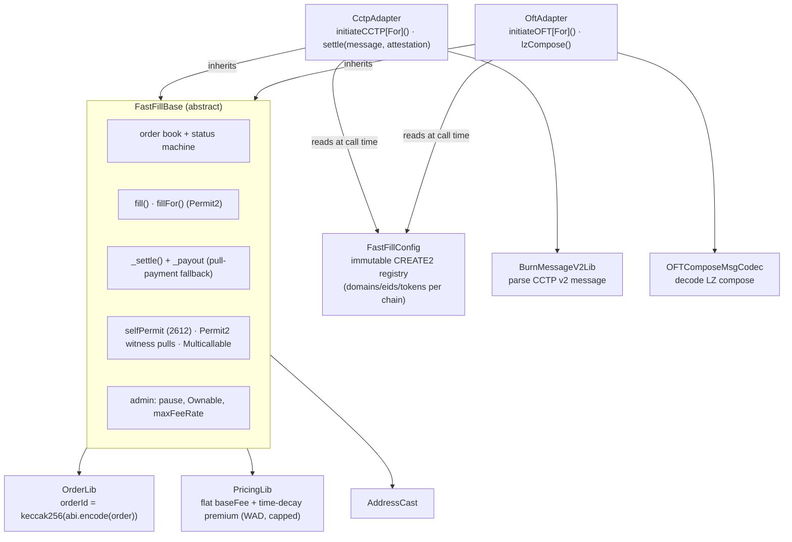
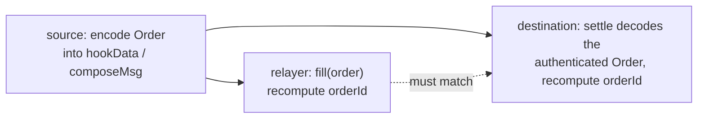
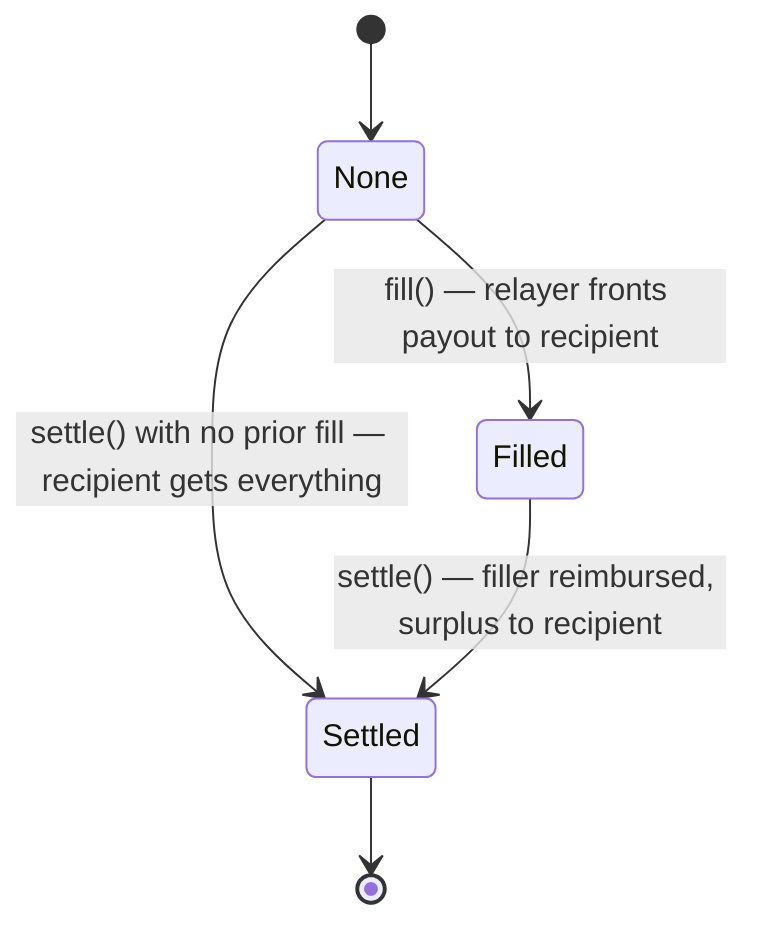
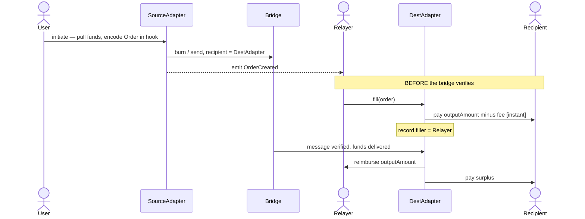
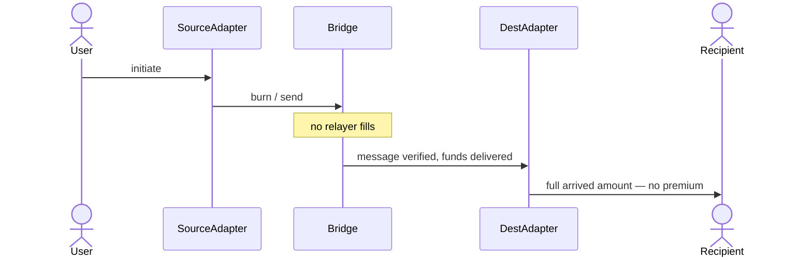
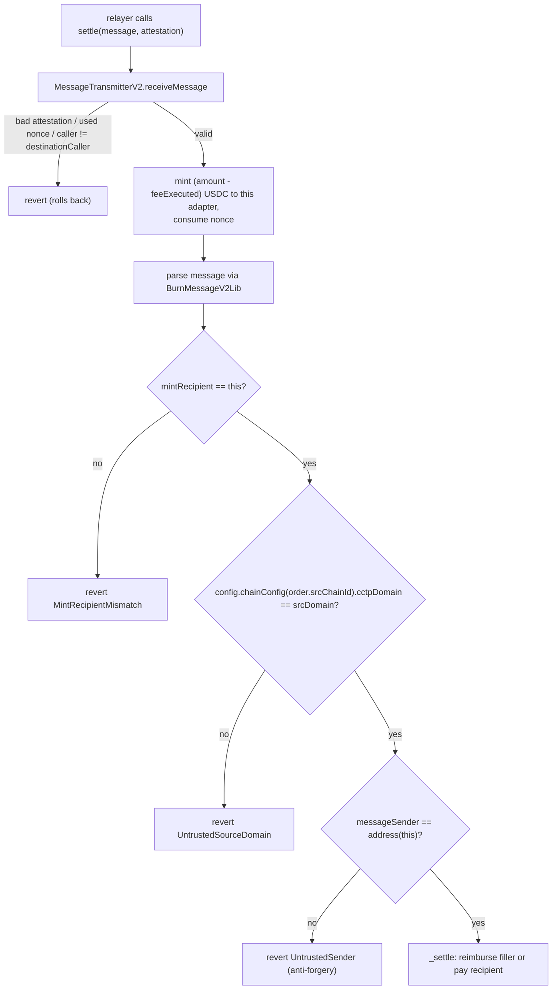
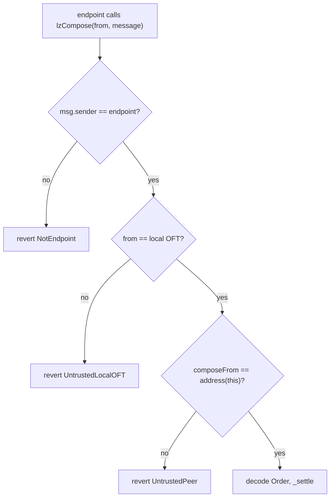
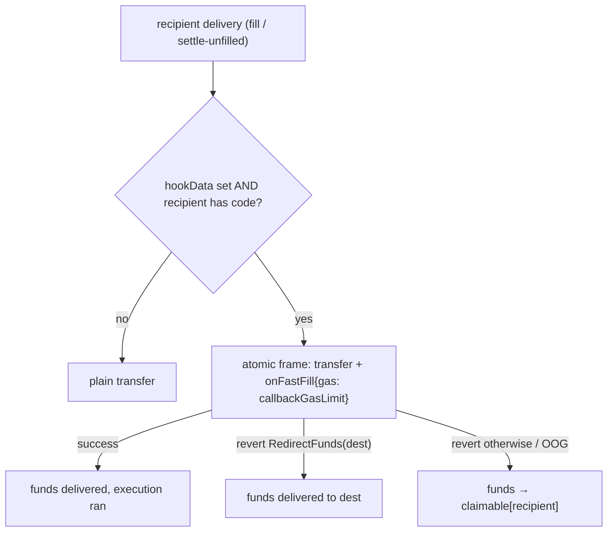

# fast-fill — Architecture

fast-fill is a thin **optimistic-fill layer** over message-based bridges (Circle **CCTP v2** and
LayerZero **OFT**). It lets external relayers pre-pay a cross-chain transfer on the destination
chain *before* the underlying bridge message is verified, in exchange for a small, user-priced
time premium. When the bridge message finally settles, the bridged funds reimburse the relayer (if
the order was filled) or flow straight to the recipient (if it was not).

- **Best case:** the user receives funds in seconds (a relayer fills).
- **Worst case:** the user receives funds exactly when the underlying bridge would have delivered
  them — and pays nothing extra.
- **No escrow, no relayer liquidity pool:** the in-flight bridged funds *are* the relayer's
  reimbursement.

---

## 1. Contract topology



The two adapters are **deployed at separate addresses**, so the CCTP USDC reimbursement pool and the
OFT-token pool are physically isolated — a decode/auth bug in one adapter can never reach the
other's funds. All shared lifecycle logic lives once in the `abstract` base (inlined at compile
time, no extra call cost). Each adapter is **bidirectional**: it initiates outbound transfers *and*
settles inbound ones, and is deployed on every supported chain.

| Contract | Responsibility |
|---|---|
| `FastFillBase` | Order book, status machine, `fill`/`fillFor`, `_settle`, `_payout` fallback, destination-execution callback (`onFastFill`), pricing call, pause, ownership, EIP-2612 `selfPermit` + Permit2 pulls + `Multicallable` |
| `FastFillConfig` | Immutable CREATE2 chain registry — per-chain CCTP/LZ addresses, domains, eids, USDC + USD₮0 tokens; the single source the adapters read at call time |
| `CctpAdapter` | `initiateCCTP`/`initiateCCTPFor` (burn-with-hook) and `settle(message, attestation)` (wraps `receiveMessage`) |
| `OftAdapter` | `initiateOFT` (`send` with `composeMsg`) and `lzCompose` (LayerZero compose callback) |
| `OrderLib` | The `Order` struct and its canonical hash / encode / decode |
| `PricingLib` | The time-decay fee curve (pure) |
| `BurnMessageV2Lib` | Parse the fields fast-fill needs from a CCTP v2 message |
| `OFTComposeMsgCodec` | Decode a LayerZero OFT composed message |
| `AddressCast` | Checked `bytes32 ↔ address` |

---

## 2. The load-bearing invariant: `orderId`

```
orderId = keccak256(abi.encode(order))
```

The same `orderId` is computed in three places:



Because the order data settles through the bridge's **authenticated channel** (a Circle-attested
message or a LayerZero-verified compose), a relayer that fills against a *fabricated* order computes
an `orderId` that no settling message will ever reproduce — so that relayer is simply never
reimbursed. **Fills are therefore trustless from the protocol's perspective: a careless or
malicious filler can only lose its own funds, never the recipient's, the protocol's, or another
filler's.** This is why filling is permissionless by default.

---

## 3. Order lifecycle



- `fill` requires `status == None` (rejects double-fill and fill-after-settle).
- `settle` requires `status != Settled` (the bridge's own nonce is the first, independent replay
  guard; this app-level check is defense-in-depth).
- `Settled` is terminal. The destination contract's balance is the reimbursement pool, and every
  order settles exactly once.

The record packs into one storage slot:

```solidity
struct OrderRecord { address filler; FillStatus status; uint40 fillTime; }
```

---

## 4. The two flows

### 4a. Optimistic fill (best case)



### 4b. No fill (worst case = same as the bridge alone)



---

## 5. Pricing

The fee a relayer earns has two **additive** parts: an optional flat `baseFee` owed on any fill, and a
time premium that is largest right after `startTime` (the relayer fronts capital longest) and decays
linearly to zero at `expectedDeliveryTime`. A late or never-filled order costs the user nothing beyond
the bridge.

```
timeSaved = max(0, expectedDeliveryTime - max(fillTime, startTime))
rate      = min(discountRate * timeSaved, maxFeeRate)          [WAD]
timeFee   = outputAmount * rate / 1e18
fee       = min(baseFee + timeFee, outputAmount)
payout    = outputAmount - fee     (paid to the recipient at fill time)
```

- `baseFee` is **per-order, user-chosen**, in output-token units (e.g. `10_000` = $0.01 USDC). It lets
  a user pay a fixed price for the relaying service regardless of timing. `baseFee == 0` is the pure
  time curve; `discountRate == 0` is a pure flat fee. It is validated `< outputAmount` at create time,
  and the combined fee is capped at `outputAmount` so the recipient payout never underflows.
- `discountRate` is **per-order, user-chosen** (the time-premium accrual per second).
- `maxFeeRate` is a **per-adapter governance cap** on the *rate* (`<= 1e18`); `baseFee` is uncapped by
  governance — it is the user's own choice, like `discountRate`.
- The curve is a standalone pure library (`PricingLib`) — monotonic in fill time, capped, overflow-safe.

**Timing is derived on-chain.** Both `startTime` and `expectedDeliveryTime` are set by the contract:
`startTime = block.timestamp`, and the user supplies a **relative `deliveryWindow`** (seconds) from
which `expectedDeliveryTime = block.timestamp + deliveryWindow`. The bridges expose no on-chain
"expected delivery time" getter, so the window is the user's estimate (off-chain clients seed a sane
default from known bridge latencies). Signing a *relative* window — rather than an absolute timestamp —
means the window the user agreed to holds no matter when a sponsoring relayer actually submits.

---

## 6. CCTP v2 integration

**Source.** `initiateCCTP` pulls USDC, builds the `Order`, and calls
`TokenMessengerV2.depositForBurnWithHook` with `mintRecipient == destinationCaller == the
destination adapter`, and the order in `hookData`. `outputAmount = inputAmount - maxFee` is the
deterministic worst case the filler is owed (`feeExecuted <= maxFee`).

**Destination.** Settlement is atomic and authenticated:



Because the source sets `destinationCaller` to the destination adapter, **only that adapter can call
`receiveMessage`**, so the mint and the settlement are one atomic transaction. The extra
`messageSender == address(this)` check is critical anti-forgery: the adapter is CREATE2-deterministic,
so its counterpart on every chain is the *same address*. Anyone can craft their own CCTP burn to our
adapter with a fabricated order in `hookData`, but they cannot make the burn's `messageSender` be our
adapter address — so such a burn can never be settled here (which would otherwise let an attacker
pre-settle a real order's id and strand the genuine transfer).

**Per-chain USDC.** USDC has a *different address on every chain*, so the source stamps
`order.outputToken` with the **destination's** USDC, resolved from `config.chainConfig(dstChainId).usdc`;
the destination checks `order.outputToken` against its own `config.chainConfig(block.chainid).usdc`.
(This was a real bug surfaced by the live mainnet run — the single-token unit tests had masked it.)

**Bridge mode (user-chosen, signed).** The user picks the transfer speed via `minFinalityThreshold`
(`FINALITY_FAST = 1000` → a fast soft-finality transfer, charging up to `maxFee`; `FINALITY_FINALIZED
= 2000` → wait for hard finality, set `maxFee = 0`) and the fast-fee budget via `maxFee`. fast-fill
deliberately does **not** use Circle's auto-relay/forwarding: it sets `destinationCaller =
address(this)` so only this adapter can call `receiveMessage`, which keeps the mint and the
optimistic-fill reconciliation in one atomic transaction (and stops a griefer from consuming the
message nonce without running `_settle`). Settlement is therefore **permissionless but
adapter-mediated** — anyone may relay the `settle` call, there is no auto-forwarder. Both knobs are
the user's: their own tx in the self-submitted path, and bound into the signature (`bridgeParams`, §9)
in the sponsored path.

CCTP interfaces are hand-written `^0.8` mirrors (`ITokenMessengerV2`, `IMessageTransmitterV2`)
because Circle's reference contracts are pinned to solc `0.7.6` and can't be imported here.

---

## 7. LayerZero OFT integration

**Source.** `initiateOFT` pulls the OFT token and calls `OFT.send` with the order in `composeMsg`
and `to == address(this)` (our adapter on the dst chain — the same CREATE2 address). `outputAmount =
minAmountLD`.

**Destination.** The OFT credits the bridged tokens to the adapter during `_lzReceive`; then the
endpoint invokes `lzCompose`, which is authenticated by **three gates**:



This is the OFT analogue of CCTP's `destinationCaller` + `messageSender` checks: `composeFrom`
(embedded in the verified message) must be our adapter's own address (`address(this)`, the same on
every chain). LayerZero's `OFTComposeMsgCodec` layout is mirrored locally.

**Bridge mode (executor).** Unlike CCTP, an OFT has **no per-transaction fast/slow switch** — delivery
speed is the pathway's DVN/confirmation configuration, set per-OApp by the OFT owner (fixed for USD₮0).
What the user controls is `extraOptions`: the executor/DVN options, which must include a compose-gas
allowance so the LayerZero **executor auto-delivers** `lzReceive` (the mint) and `lzCompose` (the
settle), paid by the `msg.value` native fee at the source. So OFT settlement *is* auto-delivered by the
executor (and anyone may also drive a queued compose), whereas CCTP settlement is relayed to our
`settle`. The user's `extraOptions` is **signed** in the sponsored path (`bridgeParams`, §9), so a
relayer cannot downgrade the executor configuration the user opted into.

---

## 8. Settlement & the pull-payment fallback

`_settle` disburses the arrived funds and is the only place that moves the reimbursement pool:

```solidity
owed    = min(arrived, order.outputAmount)
surplus = arrived - owed
if (filled) { payout(filler, owed); payout(recipient, surplus); }
else        { payout(recipient, arrived); }
status = Settled
```

`_payout` does a return-value-checked transfer; if the push fails (e.g. a USDC-blacklisted or
reverting recipient), it credits a `claimable[account][token]` ledger instead of reverting — so a
hostile recipient can never brick settlement. The party withdraws later via `claim()` (which is
never pausable). Effects (status) are written before any external transfer; `fill`, `settle`,
`lzCompose`, and `claim` are `nonReentrant`.

---

## 9. Destination executions

An order may carry a destination-execution payload — `hookData` plus a user-signed `callbackGasLimit`.
When the funds reach the recipient (a relayer's `fill`, or `_settle`'s unfilled branch) **and the
recipient is a contract**, the adapter calls `IFastFillReceiver.onFastFill(orderId, token, amount,
hookData)` in the **same atomic frame** as the transfer. Empty `hookData`, or a codeless recipient (EOA
/ undeployed), skips the call and just delivers the funds. One interface serves both adapters.



The failure policy is **governed by the receiver's revert data, not the signed order** — the recipient
is the user's own contract, so it decides at runtime. This mirrors CCTP v2's atomic-with-delivery hooks
but is strictly safer: because the transfer and the callback share one revertable frame, a
deterministically-failing hook can never strand the bridged funds — they always end delivered,
redirected, or claimable. Hardening:

- **Gas cap.** The call forwards exactly `callbackGasLimit`; the adapter first requires enough gas
  remains (EIP-150 63/64) so a relayer cannot starve the user's signed budget (else `fill`/`settle`
  reverts, forcing a retry). The limit is signed — in the order and the Permit2 witness — so the
  relayer prices it into the base fee and a sponsor cannot alter it.
- **Return-bomb-safe.** The revert data is copied with a bounded length (enough for `RedirectFunds`),
  so a receiver cannot grief the relayer with a huge returndata payload.
- **Reentrancy.** Delivery runs inside the existing `nonReentrant` fill/settle with effects written
  first, so the receiver cannot re-enter `fill`/`settle`/`claim` (it reverts → funds become claimable).
- **Atomic claw-back.** If the callback moves funds out and then reverts, the whole frame rolls back,
  so the receiver cannot keep part of the funds and redirect the rest.

A filled order runs its hook once, at fill; the dust surplus paid to the recipient at settle is a plain
transfer (no second callback), and the filler reimbursement is never hooked.

---

## 10. Configuration & admin

**All chain config is immutable and lives in [`FastFillConfig`](../src/config/FastFillConfig.sol)** —
a contract CREATE2-deployed to one address on every chain, holding a per-chain row
`{supported, cctpDomain, lzEid, usdc, cctpTokenMessenger, usdt0Oft, usdt0Token}` baked as constants.
Each adapter takes a single `config` argument (plus `owner`, `maxFeeRate`, all identical across
chains), so the adapters are themselves CREATE2-deterministic. There are **no owner setters for
addresses, domains, eids, or counterparts** — those are read from the registry at call time, keyed by
`block.chainid` for the local chain and by the order's chain ids for the remote side. The counterpart
is always `address(this)`; "does the remote chain exist" is `config.supported`.

The adapter additionally **reads the local domain/eid/token live from the bridge contracts**
(`MessageTransmitter.localDomain`, `Endpoint.eid`, `OFT.token`/`endpoint`) and reverts on any mismatch
with the registry — so a wrong constant can't silently ship. Adding a chain means publishing a new
registry version + adapters (a new deterministic address set).

Owner-gated (`Ownable`) surface is intentionally tiny: `setMaxFeeRate(rate)` and `setPaused(bool)`.
Filling is **permissionless** — anyone may fill, since the `orderId` invariant makes a fill against a
fabricated order self-punishing (the filler is simply never reimbursed); there is no filler allowlist.

**Gasless / sponsored funding.** `selfPermit` (EIP-2612) + `Multicallable` give a single-tx
approve+act; `initiate*For` / `fillFor` pull from a signer who is not `msg.sender` via Permit2
`permitWitnessTransferFrom`, with the witness bound to the order intent (or orderId) so a submitting
relayer cannot alter what was signed. The order-intent witness binds the recipient, the amounts, the
relative `deliveryWindow`, the `discountRate`, the `baseFee`, **and** a `bridgeParams` hash of the
transport mode the user opted into (CCTP: `keccak256(maxFee, minFinalityThreshold)`; OFT:
`keccak256(extraOptions)`) — so a relayer can neither re-price, re-time, nor change the bridging
speed / executor of a signed intent.

---

## 11. Security model

| Vector | Defense |
|---|---|
| Double-fill / fill-after-settle | `fill` requires `status == None`. |
| Replay of a bridge message | CCTP `receiveMessage` consumes the nonce; LZ enforces nonce ordering; plus the `status != Settled` app guard. |
| Fake-order fill | Non-matching `orderId` ⇒ never reimbursed (self-punishing). |
| Forged CCTP burn to our adapter | `messageSender == address(this)` rejects burns not initiated by our (same-address) adapter. |
| Forged OFT compose | Three gates: endpoint, local OFT, `composeFrom == address(this)`. |
| Misconfigured registry | Local domain/eid/token are read live from the bridge contracts and cross-checked against `FastFillConfig`; a mismatch reverts. |
| Sponsor altering a signed intent | Permit2 witness binds the order intent / orderId **and the opted-into bridge mode** (`bridgeParams`); a tampered order — or a flipped fast/slow / executor option — recovers a different signer and reverts (both proven against real Permit2). |
| Reentrancy | `nonReentrant` + checks-effects-interactions (status before transfers). |
| Hostile destination receiver | The `onFastFill` callback is gas-capped, return-bomb-safe, runs behind `nonReentrant` in an atomic transfer+call frame; any failure routes to redirect/claimable — it can never brick the fill/settle, strand funds, or keep funds it wasn't owed. |
| Recipient/filler revert (e.g. USDC blacklist) | `_payout` falls back to the `claimable` ledger; settlement still completes. |
| Surplus theft | Surplus is computed inside the authenticated settle and always routed to `order.recipient`; the filler is hard-capped at `outputAmount`. |
| Underpaying the user on fill | `fill` computes `payout` on-chain and pulls exactly that from the relayer. |
| Cross-adapter confusion | `order.bridgeType` + token/peer/chain checks + physically separate deployments. |

> **Status:** prototype, not audited. The pricing curve and surplus routing (currently → recipient)
> are intended iteration points. Filling is permissionless by design.
